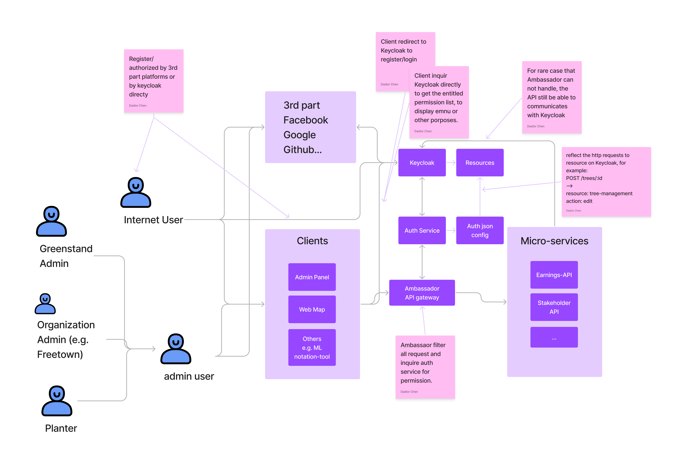

# Use Keycloak + Ambassador to provide Single Sign-on and protect all our micro-services

* Status: proposed 
<!-- {proposed | rejected | accepted | deprecated | … | superseded by [ADR-0005](0005-example.md)} --> <!-- optional -->
* Deciders: Nick Charlton, Tuan-Anh Nguyen, Dadiorchen, Zaven, Daniel, Gwynn Dandridge-Perry
<!-- Find deciders here: https://github.com/orgs/Greenstand/people  -->
* Date: Mon Jul 18 11:05:04 CST 2022

## Context and Problem Statement

The solution:

<!-- the image of this solution -->

Considerations:

* Basically, all our clients (e.g the amdin panel) that want to log in by users would install Keycloak's client and redirect to Keycloak's pages to finish: 
  * 3rd part authorization
  * login

  For the case that the user want to use Keycloak directly, Keycloak will provider pages to:
  
  * registration
  * login
  * reset password
  * change user profile.

* Use Ambassador to intercept all requests to our micro-services, and use a dedicated note.js auth-service to handle the authentication, this auth-service would set a config to reflect all RESTful requests to Keycloak's resource based permission. For example:
  * GET /trees/:tree_id -> resource: tree-management action: read
  * POST /trees/:tree_id -> resource: tree-management action: edit

  The frist one means the user is able to view the tree, and the second one means the user is able to edit the tree.

  (To Tuan-Anh Nguyen), for some details, the Ambassador has built-in support for the oAuth2 , by the Ambassador Filter & Filter Policy, as you told me, that's an easier solution, but unfortunately, the Ambassador Filter Policy can not support bringing the http method to the Keycloak side, so we can not implement the resource based authentication, the Ambassador solution seems do not support a fine-grained auth system.
  
  And I also find the Ambassador didn't talked too much about how to cache the authentication result or similar mechanism, so if we implement it by ourselves, we can control, optimize this part more freely.

  Here are some related resources:
  https://stackoverflow.com/questions/72780645/how-to-reflect-http-method-to-keycloak-resource-when-using-ambassador-filter/72790483#72790483
  https://www.getambassador.io/docs/edge-stack/latest/topics/using/filters/oauth2/

* All the client can get the user profile, information, and permission list from Keycloak, to use it to display user info and decide the visible menu items.

* It's possible that the Ambassador can not handle some special cases , in this case, a single API service can still communicate with Keycloak to do the authentication, but I think in most case, the Ambassador can handle the authentication.

* So in most case, to create/update the authentication of a single HTTP request to the micro-service, we just need to set two places on the system:
  * The auth-service, to define the http request to  Keycloak resource reflect.
  * The Keycloak, to create the resource, action, and bind the resource to some user (by some policy on the Keycloak).

  So for most of the micro-services, the authentication workflow is transparent, we don't need to set every mocro-service for it.

## Decision Drivers <!-- optional -->

* {driver 1, e.g., a force, facing concern, …}
* {driver 2, e.g., a force, facing concern, …}
* … <!-- numbers of drivers can vary -->

## Considered Options

* {option 1}
* {option 2}
* {option 3}
* … <!-- numbers of options can vary -->

## Decision Outcome

Chosen option: "{option 1}", because {justification. e.g., only option, which meets k.o. criterion decision driver | which resolves force {force} | … | comes out best (see below)}.

### Positive Consequences <!-- optional -->

* {e.g., improvement of quality attribute satisfaction, follow-up decisions required, …}
* …

### Negative Consequences <!-- optional -->

* {e.g., compromising quality attribute, follow-up decisions required, …}
* …

## Pros and Cons of the Options <!-- optional -->

### {option 1}

{example | description | pointer to more information | …} <!-- optional -->

* Good, because {argument a}
* Good, because {argument b}
* Bad, because {argument c}
* … <!-- numbers of pros and cons can vary -->

### {option 2}

{example | description | pointer to more information | …} <!-- optional -->

* Good, because {argument a}
* Good, because {argument b}
* Bad, because {argument c}
* … <!-- numbers of pros and cons can vary -->

### {option 3}

{example | description | pointer to more information | …} <!-- optional -->

* Good, because {argument a}
* Good, because {argument b}
* Bad, because {argument c}
* … <!-- numbers of pros and cons can vary -->

## Links <!-- optional -->

* {Link type} {Link to ADR} <!-- example: Refined by [ADR-0005](0005-example.md) -->
* … <!-- numbers of links can vary -->
